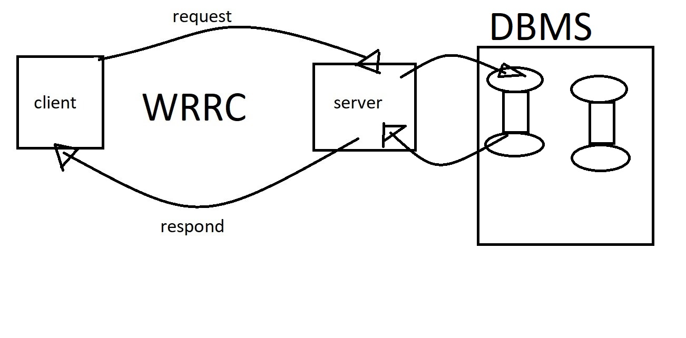

# Movies-Library

# Movive-library - Project Version 1

**Author Name**: AMMAR ALBESANI

## WRRC

## Overview
This web site will be one of the rich move libraries that will contain all new move .

## Getting Started
After create an empty repo with (gitignore (node)) and (license(mit))
the clone repo and then create your server by typing in terminal tough server.js
then type npm init-y to initialize your server using node js
then install express by typing npm i express 

## Project Features

I ues '/' path to the main page that have a constructor to manage the structure of the respond

there is a favorite page with '/favorite' path

any unknown path will have 404 status with "page not found " respond

server error will respond "status": 500,
"responseText": "Sorry, something went wrong"

we use cors in order to handel many request in the same time

we use try catch method to handel request error
we ues .then catch to handel code error
we use api 3rd party to take move from it
now we update our app and linked it to database we created using postgrs
